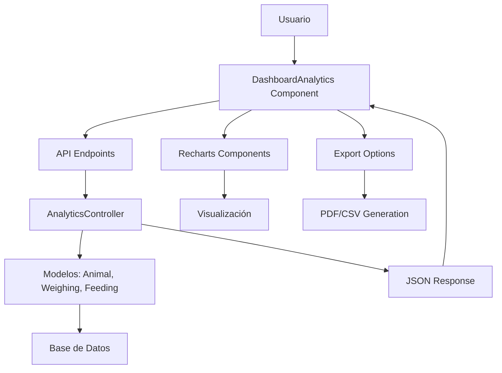

# Plan de Arquitectura para Módulo de Dashboard Analítico

## Visión General
El módulo de dashboard analítico proporcionará visualizaciones interactivas de métricas clave para el sistema de feedlot, incluyendo tendencias de producción, crecimiento animal y consumo de alimento. Se integrará con los modelos existentes (Animal, Weighing, Feeding, Lot) y ofrecerá filtros por fecha, lote y animal, con opciones de exportación y actualizaciones en tiempo real.

## Métricas Clave
- **Producción de Carne**: Peso total de animales retirados por mes/año (basado en `weight_current` de animales con `withdrawal_date` en el período).
- **Crecimiento Animal**: Peso promedio por edad/etapa, tasa de crecimiento (promedio de `daily_gain` de Weighing).
- **Consumo de Alimento**: Distribución por tipo de alimento (`FeedType`) y cantidad total (`total_ration` de Feeding).

## Estructura de Datos para Gráficos
Los endpoints API devolverán datos en formato JSON compatible con bibliotecas de gráficos:
```json
{
  "labels": ["Enero", "Febrero", "Marzo"],
  "datasets": [
    {
      "label": "Producción (kg)",
      "data": [1000, 1200, 1100]
    }
  ],
  "filters": {
    "date_from": "2023-01-01",
    "date_to": "2023-12-31",
    "lot_id": null,
    "animal_id": null
  }
}
```

## API Endpoints
- `GET /api/analytics/production-trends?date_from=...&date_to=...&lot_id=...&animal_id=...`
- `GET /api/analytics/animal-growth?date_from=...&date_to=...&lot_id=...&animal_id=...`
- `GET /api/analytics/feed-consumption?date_from=...&date_to=...&lot_id=...&feed_type_id=...`

## Integración con Modelos
- **Animal**: Usar `weight_current`, `withdrawal_date`, `lot_id` para producción.
- **Weighing**: `weight`, `daily_gain`, `date`, `animal_id` para crecimiento.
- **Feeding**: `total_ration`, `feed_type_id`, `date`, `lot_id` para consumo.
- **Lot**: Para filtros y agrupación.

## Componentes Frontend
- **DashboardAnalytics**: Página principal con filtros y gráficos.
- **ChartComponent**: Componente reutilizable para gráficos de línea/barra/pie usando Recharts.
- **FilterPanel**: Panel de filtros por fecha (date picker), lote (select), animal (select opcional).

## Actualizaciones en Tiempo Real
- Implementar polling cada 5 minutos para refrescar datos.
- Opcional: Usar Laravel Echo con WebSockets para actualizaciones push.

## Opciones de Exportación
- **PDF**: Generar reporte con gráficos usando dompdf o similar.
- **CSV**: Exportar datos crudos de los gráficos.

## Flujo de Datos


## Próximos Pasos
1. Definir métricas clave detalladamente.
2. Diseñar estructura de datos para gráficos.
3. Crear API endpoints.
4. Integrar con modelos existentes.
5. Diseñar componentes frontend.
6. Implementar actualizaciones en tiempo real.
7. Agregar opciones de exportación.
8. Definir flujo de datos completo.