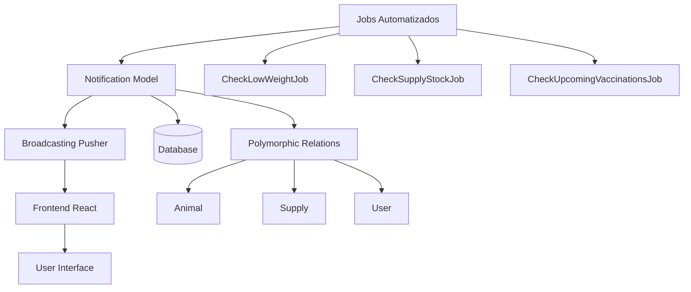

# Arquitectura del Sistema de Notificaciones en Tiempo Real para Feedlot

## Análisis del Esquema Existente

### Modelos Principales y Relaciones

- **User**: Modelo de autenticación con roles/permisos (Spatie Permission).
- **Animal**: Relaciones con Breed, Lot, Weighings, MedicalHistories, VeterinaryTreatments, HealthAlerts.
- **Supply**: Gestión de inventario con stock_current y min_stock.
- **Lot**: Lotes de animales.
- **Breed**: Razas.
- **Weighing**: Pesajes con daily_gain.
- **HealthAlert**: Alertas de salud por animal.
- **MedicalHistory**: Historial médico.
- **VeterinaryTreatment**: Tratamientos aplicados.
- **TreatmentCatalog**: Catálogo de tratamientos.
- **Vaccine**: Vacunas con withdrawal_days.

### Base de Datos
- SQLite para desarrollo.
- Tablas con foreign keys apropiadas.
- Sistema de jobs y cache disponible.

## Arquitectura del Sistema de Notificaciones

### Modelo Notification

```php
// app/Models/Notification.php
class Notification extends Model
{
    protected $fillable = [
        'type',
        'title',
        'message',
        'data',
        'read_at',
        'user_id',
        'notifiable_type',
        'notifiable_id',
    ];

    protected $casts = [
        'data' => 'array',
        'read_at' => 'datetime',
    ];

    // Relaciones polimórficas
    public function notifiable()
    {
        return $this->morphTo();
    }

    public function user()
    {
        return $this->belongsTo(User::class);
    }

    // Scopes
    public function scopeUnread($query)
    {
        return $query->whereNull('read_at');
    }

    public function scopeForUser($query, $userId)
    {
        return $query->where('user_id', $userId);
    }
}
```

### Migración

```php
// database/migrations/XXXX_create_notifications_table.php
Schema::create('notifications', function (Blueprint $table) {
    $table->id();
    $table->string('type'); // 'low_weight', 'low_stock', 'upcoming_vaccination', etc.
    $table->string('title');
    $table->text('message');
    $table->json('data')->nullable();
    $table->timestamp('read_at')->nullable();
    $table->foreignId('user_id')->constrained()->onDelete('cascade');
    $table->morphs('notifiable'); // notifiable_type, notifiable_id
    $table->timestamps();

    $table->index(['user_id', 'read_at']);
    $table->index(['notifiable_type', 'notifiable_id']);
});
```

## Broadcasting y Tiempo Real

### Configuración Broadcasting

**Elección: Pusher** (más fácil integración con Laravel, buena documentación).

```php
// config/broadcasting.php
'connections' => [
    'pusher' => [
        'driver' => 'pusher',
        'key' => env('PUSHER_APP_KEY'),
        'secret' => env('PUSHER_APP_SECRET'),
        'app_id' => env('PUSHER_APP_ID'),
        'options' => [
            'cluster' => env('PUSHER_APP_CLUSTER'),
            'encrypted' => true,
            'host' => env('PUSHER_HOST') ?: 'api-'.env('PUSHER_APP_CLUSTER', 'mt1').'.pusherapp.com',
            'port' => env('PUSHER_PORT', 443),
            'scheme' => env('PUSHER_SCHEME', 'https'),
            'useTLS' => env('PUSHER_SCHEME', 'https') === 'https',
        ],
    ],
],
```

### Eventos

```php
// app/Events/NotificationCreated.php
class NotificationCreated extends Event implements ShouldBroadcast
{
    public function __construct(
        public Notification $notification
    ) {}

    public function broadcastOn(): array
    {
        return [
            new PrivateChannel('notifications.' . $this->notification->user_id),
        ];
    }

    public function broadcastAs(): string
    {
        return 'notification.created';
    }
}
```

## Jobs para Alertas Automatizadas

### CheckLowWeightJob

```php
class CheckLowWeightJob implements ShouldQueue
{
    public function handle()
    {
        $threshold = 0.8; // 80% del peso de entrada

        Animal::active()
            ->whereRaw('weight_current < weight_entry * ?', [$threshold])
            ->get()
            ->each(function ($animal) {
                Notification::create([
                    'type' => 'low_weight',
                    'title' => 'Peso bajo detectado',
                    'message' => "El animal {$animal->caravana} tiene un peso bajo ({$animal->weight_current}kg)",
                    'data' => ['animal_id' => $animal->id],
                    'user_id' => 1, // Admin o veterinario
                    'notifiable_type' => Animal::class,
                    'notifiable_id' => $animal->id,
                ]);
            });
    }
}
```

### CheckSupplyStockJob

```php
class CheckSupplyStockJob implements ShouldQueue
{
    public function handle()
    {
        Supply::whereRaw('stock_current <= min_stock')
            ->get()
            ->each(function ($supply) {
                Notification::create([
                    'type' => 'low_stock',
                    'title' => 'Stock bajo',
                    'message' => "El suministro {$supply->name} está por agotarse ({$supply->stock_current} {$supply->unit})",
                    'data' => ['supply_id' => $supply->id],
                    'user_id' => 1,
                    'notifiable_type' => Supply::class,
                    'notifiable_id' => $supply->id,
                ]);
            });
    }
}
```

### CheckUpcomingVaccinationsJob

```php
class CheckUpcomingVaccinationsJob implements ShouldQueue
{
    public function handle()
    {
        $daysAhead = 7;

        VeterinaryTreatment::with(['animal', 'treatmentCatalog'])
            ->where('applied_at', '>', now())
            ->where('applied_at', '<=', now()->addDays($daysAhead))
            ->whereHas('treatmentCatalog', function ($query) {
                $query->where('type', 'vaccination');
            })
            ->get()
            ->each(function ($treatment) {
                Notification::create([
                    'type' => 'upcoming_vaccination',
                    'title' => 'Vacunación próxima',
                    'message' => "Vacunación programada para {$treatment->animal->caravana} el {$treatment->applied_at->format('d/m/Y')}",
                    'data' => ['treatment_id' => $treatment->id],
                    'user_id' => 1,
                    'notifiable_type' => Animal::class,
                    'notifiable_id' => $treatment->animal_id,
                ]);
            });
    }
}
```

### Comando Artisan

```php
// app/Console/Commands/CheckAlerts.php
class CheckAlerts extends Command
{
    protected $signature = 'alerts:check';

    public function handle()
    {
        CheckLowWeightJob::dispatch();
        CheckSupplyStockJob::dispatch();
        CheckUpcomingVaccinationsJob::dispatch();

        $this->info('Alert jobs dispatched successfully.');
    }
}
```

## Controlador y Rutas

### NotificationController

```php
class NotificationController extends Controller
{
    public function index(Request $request)
    {
        $notifications = Notification::forUser(auth()->id())
            ->with('notifiable')
            ->orderBy('created_at', 'desc')
            ->paginate(20);

        return Inertia::render('Notifications/Index', [
            'notifications' => $notifications,
        ]);
    }

    public function markAsRead(Notification $notification)
    {
        $this->authorize('update', $notification);

        $notification->update(['read_at' => now()]);

        return response()->json(['success' => true]);
    }

    public function markAllAsRead()
    {
        Notification::forUser(auth()->id())
            ->unread()
            ->update(['read_at' => now()]);

        return response()->json(['success' => true]);
    }
}
```

### Rutas

```php
// routes/web.php
Route::middleware(['auth'])->group(function () {
    Route::get('/notifications', [NotificationController::class, 'index'])->name('notifications.index');
    Route::patch('/notifications/{notification}/read', [NotificationController::class, 'markAsRead']);
    Route::patch('/notifications/mark-all-read', [NotificationController::class, 'markAllAsRead']);
});
```

## Frontend React

### Hook Personalizado: useNotifications

```tsx
// resources/js/hooks/useNotifications.ts
import { useEffect, useState } from 'react';
import Echo from 'laravel-echo';
import Pusher from 'pusher-js';

declare global {
    interface Window {
        Pusher: typeof Pusher;
        Echo: Echo;
    }
}

export function useNotifications(userId: number) {
    const [notifications, setNotifications] = useState([]);
    const [unreadCount, setUnreadCount] = useState(0);

    useEffect(() => {
        // Inicializar Echo si no está inicializado
        if (!window.Echo) {
            window.Pusher = Pusher;
            window.Echo = new Echo({
                broadcaster: 'pusher',
                key: import.meta.env.VITE_PUSHER_APP_KEY,
                cluster: import.meta.env.VITE_PUSHER_APP_CLUSTER,
                encrypted: true,
            });
        }

        const channel = window.Echo.private(`notifications.${userId}`)
            .listen('.notification.created', (e: any) => {
                setNotifications(prev => [e.notification, ...prev]);
                setUnreadCount(prev => prev + 1);
            });

        return () => {
            window.Echo.leave(`notifications.${userId}`);
        };
    }, [userId]);

    return { notifications, unreadCount };
}
```

### Componente NotificationDropdown

```tsx
// resources/js/components/NotificationDropdown.tsx
import { useNotifications } from '@/hooks/useNotifications';
import { router } from '@inertiajs/react';

export default function NotificationDropdown({ userId }) {
    const { notifications, unreadCount } = useNotifications(userId);

    const markAsRead = (notificationId) => {
        router.patch(`/notifications/${notificationId}/read`);
    };

    return (
        <div className="relative">
            <button className="relative">
                🔔
                {unreadCount > 0 && (
                    <span className="absolute -top-1 -right-1 bg-red-500 text-white text-xs rounded-full h-5 w-5 flex items-center justify-center">
                        {unreadCount}
                    </span>
                )}
            </button>

            <div className="absolute right-0 mt-2 w-80 bg-white rounded-md shadow-lg z-50">
                {notifications.slice(0, 5).map(notification => (
                    <div key={notification.id} className="p-3 border-b hover:bg-gray-50">
                        <h4 className="font-semibold">{notification.title}</h4>
                        <p className="text-sm text-gray-600">{notification.message}</p>
                        <button
                            onClick={() => markAsRead(notification.id)}
                            className="text-xs text-blue-500 mt-1"
                        >
                            Marcar como leída
                        </button>
                    </div>
                ))}
            </div>
        </div>
    );
}
```

## Manejo de Errores y Logging

### Middleware para Logging

```php
// app/Http/Middleware/LogNotifications.php
class LogNotifications
{
    public function handle($request, Closure $next)
    {
        $response = $next($request);

        if ($response->getStatusCode() >= 400) {
            Log::error('Notification error', [
                'user_id' => auth()->id(),
                'request' => $request->all(),
                'response' => $response->getContent(),
            ]);
        }

        return $response;
    }
}
```

### Try-Catch en Jobs

```php
class CheckLowWeightJob implements ShouldQueue
{
    public function handle()
    {
        try {
            // lógica...
        } catch (Exception $e) {
            Log::error('Error in CheckLowWeightJob', [
                'error' => $e->getMessage(),
                'trace' => $e->getTraceAsString(),
            ]);

            throw $e; // Re-throw para que el job falle
        }
    }

    public function failed(Exception $exception)
    {
        Log::critical('CheckLowWeightJob failed', [
            'error' => $exception->getMessage(),
        ]);
    }
}
```

## Optimizaciones

### Lazy Loading

```php
// En controlador
$notifications = Notification::forUser(auth()->id())
    ->with(['notifiable' => function ($query) {
        $query->select('id', 'name'); // Solo campos necesarios
    }])
    ->orderBy('created_at', 'desc')
    ->paginate(20);
```

### Caching

```php
// Cache de configuración de alertas
Cache::remember('alert_thresholds', 3600, function () {
    return [
        'low_weight' => 0.8,
        'stock_days' => 7,
    ];
});
```

### Paginación

Usar paginación estándar de Laravel con `simplePaginate()` para mejor performance en grandes datasets.

## Tests

```php
// tests/Feature/NotificationTest.php
it('creates notification for low weight animal', function () {
    $animal = Animal::factory()->create([
        'weight_entry' => 100,
        'weight_current' => 70,
    ]);

    CheckLowWeightJob::dispatch();

    expect(Notification::where('type', 'low_weight')->count())->toBe(1);
});

it('broadcasts notification to user', function () {
    // Test con broadcasting fake
});
```

## Diagrama Conceptual



## Plan de Implementación Paso a Paso

1. **Análisis y Diseño** (Completado)
   - Analizar esquema existente ✓
   - Diseñar arquitectura ✓

2. **Backend - Modelo y DB**
   - Crear migración notifications
   - Implementar modelo Notification
   - Agregar relaciones polimórficas

3. **Broadcasting**
   - Configurar Pusher
   - Crear eventos de broadcasting
   - Configurar canales privados

4. **Jobs y Automatización**
   - Implementar CheckLowWeightJob
   - Implementar CheckSupplyStockJob
   - Implementar CheckUpcomingVaccinationsJob
   - Crear comando Artisan para ejecutar jobs
   - Programar jobs en scheduler

5. **API y Controladores**
   - Crear NotificationController
   - Implementar rutas
   - Agregar políticas de autorización

6. **Frontend**
   - Instalar Laravel Echo y Pusher JS
   - Crear hook useNotifications
   - Implementar componente NotificationDropdown
   - Integrar en layout principal

7. **Manejo de Errores**
   - Implementar logging en jobs
   - Crear middleware de logging
   - Configurar manejo de excepciones

8. **Optimizaciones**
   - Implementar lazy loading
   - Agregar caching
   - Optimizar consultas

9. **Testing**
   - Crear tests unitarios para jobs
   - Crear tests de feature para notificaciones
   - Tests de broadcasting

10. **Documentación**
    - Documentar API
    - Crear guía de uso
    - Documentar configuración

## Consideraciones de Seguridad

- Autorización: Solo usuarios pueden ver sus propias notificaciones
- Validación: Sanitizar datos de notificaciones
- Rate limiting: Limitar creación de notificaciones
- Encriptación: Datos sensibles en broadcasting

## Escalabilidad

- Queue para jobs pesados
- Cache para configuraciones
- Paginación para listados grandes
- Índices en DB para consultas frecuentes

Esta arquitectura proporciona un sistema robusto, modular y mantenible para notificaciones en tiempo real en la aplicación Feedlot.